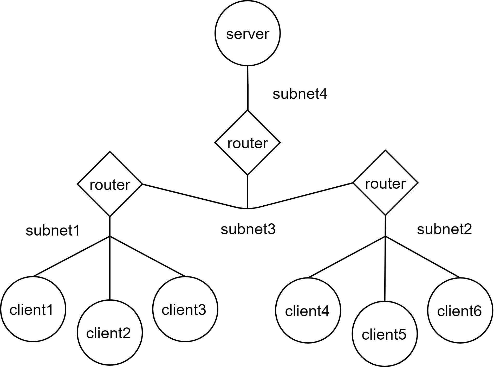
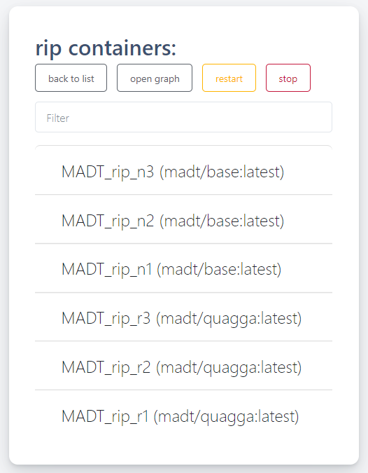
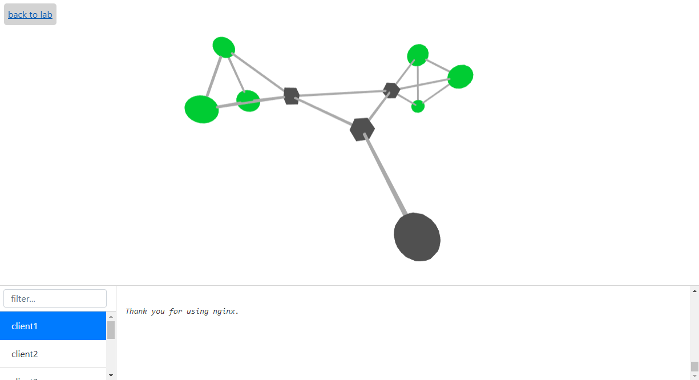

[](https://travis-ci.com/dltcspbu/madt)
[](https://codecov.io/gh/dltcspbu/madt)

# MADT - a distributed application modelling system

Main features of MADT:

* Realistic simulation of large scale IP networks,
* Deployment of a distributed application in the simulated network,
* Dynamic control over network conditions in individual sections of the simulated network,
* Real-time visualization of the application state.

## Examples
### Blockchains
 * [Etherium geth over madt](https://github.com/KapiWow/geth_madt)
 * [Corda over madt](https://github.com/franceskoizump/corda-madt)
 * [Tendermint over madt](https://github.com/nuvard/madt_thunder) [Video (russian)](https://youtu.be/VTc6GH9Uy28?list=PLoDvqBmgo3AEnntVfVXjlIDclLMWEglJL)
 * [Neo blockchain over madt](https://github.com/AnnaShaleva/madt_sample) [Video (russian)](https://www.youtube.com/watch?v=JBxCYYmd5cU&list=PLoDvqBmgo3AEnntVfVXjlIDclLMWEglJL&index=3&t=0s)
 * [Exonum over madt (russian readme)](https://github.com/IvPod/Madt_Exonum)
 * [Hyperledger Fabric over madt (russian readme)](https://github.com/NightBlade97/Madt_HL_Fabric)
 
 ### Other
  * [Kubernates with Istio over madt (russian readme)](https://github.com/IvPod/Madt_Kind) [Video (russian)](https://www.youtube.com/watch?v=SlaIgHL8YRc)

## Сore entities

The primary entity in MADT is a laboratory, a model of the simulated network. 
To start a model, MADT uses a minimal amount of information about virtual network structure and launch procedure of distributed application. 
This set of information also can be referred to as a model. MADT stores this information in the JSON-serialized file, lab.json. 

A graph represents the simulated network. Nodes of this graph can be a server, client, or router.
You can combine part of the network (a set of nodes) into a subnet and define rules for such subnet as well as configure the whole network. 



## How to define the model

We use madt_lib Python API to configure a model. It provides four classes for defining a network model:

* madt_lib.Node represents network nodes. There are two types of nodes: routers and computers (PC). Routers provide dynamic routing of packets on the network and PCs host components of the tested application.
* madt_lib.Subnet represents an IP subnetwork that connects a set of nodes.
* madt_lib.Overlay used to configure dynamic routing in the network. This is necessary for transferring data between computers from different subnets. 
* madt_lib.Network represents a wide or local area network. Each node, subnet or overlay of a network should be created only using its methods. A laboratory can have only one global network that can be used to create multiple local ones. 

Basic example with simple server-client interaction is defined in [tutorial/basic](https://github.com/dltcspbu/madt/blob/master/tutorials/basic/) folder.

## How to check the model

MADT provides a monitoring system that allows you to send messages from the model nodes and display them in real-time in the web interface.
To get the monitoring page, go to container page and then push the "open graph" button. 



You can check the state of nodes which is shown via colour schema and logs in the lower logger window.



Cubic nodes of the graph represent routers and round ones - all the other nodes of the model. Colour of the node corresponds to its status, and it can be one of the following:

* 0 - green 
* 1 - yellow
* 2 - red
* 3 - purple 

User has to define the meaning of status codes himself and set the new value of this code with `send()` function. 

Grey nodes are inactive. Blue nodes are the ones who were active earlier.

## How to test your application

Caution! Work in progress!

## How to launch MADT without installation

```
mkdir ~/madt/labs && export MADT_LABS_DIR=$HOME/madt/labs
mkdir ~/madt/sockets && export MADT_LABS_SOCKETS_DIR=$HOME/madt/sockets
sudo -HE env PYTHONPATH=$HOME/madt:$PYTHONPATH SSH_PWD=demo python3 madt_ui/main.py 80    
```

## Docs

English docs: http://madt.io/docs/

Russian docs: http://madt.io/rudocs/


## Docker runtime
### Build sequence:
#### Server:

   `docker build -t madt .`

### Start sequence:
```bash
    docker run -d --privileged -p 8980:80 -p 8922:22 \
        -e SSH_PWD=demo \
        -e MADT_RUNTIME=docker madt
```


## Cluster runtime

Caution! Work in progress!

### Build sequence:

### Server:
For now, same as before. 

#### Host:
To build host image you'll need only `Dockerfile_image`, `madt_host`, `madt_client` and `images`  

1. `docker build -t madt/host -f Dockerfile_host .` 

### Start sequence:
#### Server
Since tinc daemons on hosts must connect to the server somehow, we're publishing a wide range of ports for server's tinc daemon to use. Port publication must map the to the same ports on a host. 
However, it's possible to change port range used by changling `PORT_RANGE` variable in cluster 
runtime.
```bash
   docker run -it -m 10GB --privileged --runtime kata-runtime --name madt \  
        -v ~/madt/labs:/home/demo/labs \
        -p 9080:80 -p 9022:22 -p 9077:7000 \ 
        -p 9100-9200:9100-9200 \
        -e SSH_PWD=demo \
        -e MADT_SERVER_ADDRESS=40.112.66.112 madt:test
```

#### Host
Note that before starting host you must make sure that both docker and ssh port are vacant on the server.
`MADT_UI_PORT` and `MADT_FRPC_PORT` correspond to published 80 and 7000 port of the server.  
```bash
    docker run --privileged -it --name madt  \
        -e MADT_SERVER=40.112.66.112 \
        -e MADT_UI_PORT=9080 \
        -e MADT_FRPS_PORT=9077 \
        -e SSH_PORT=9201 \   
        -e DOCKER_PORT=9202 madt/host:test
```

## Alternatives
 * [For more library based approach - l3ns](https://github.com/rukmarr/l3ns)
 * [Containernet based on mininet](https://github.com/containernet/containernet)
 * [For lover level modeling - NS3 with Docker and vizceral](https://github.com/Mainzi/vizceral-NS3DockerEmulator)
