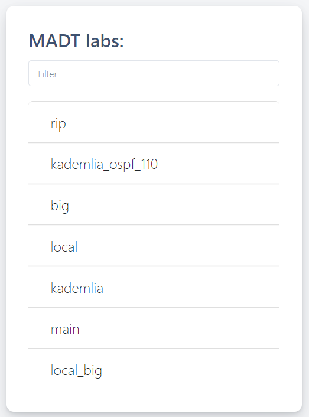
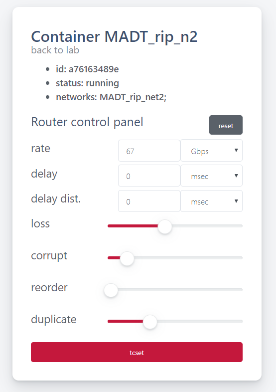
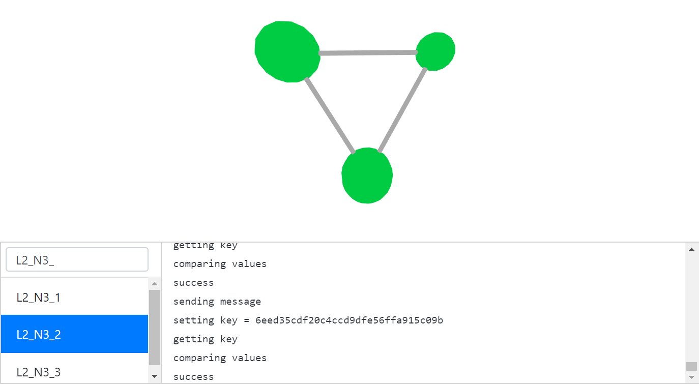

User's guide
============

The main object around which the entire MADT system is built is a laboratory or, otherwise,
a model of the network. These terms are used interchangeably and refer to the virtual IP network
and a distributed application that’s running on top of the virtual network. To start a model
MADT uses a minimal amount of information about virtual network structure and launch procedure of
distributed application. This set of information also can be referred to as a model. MADT stores
this information in the JSON-serialized file, lab.json.

The :py:mod:`madt_lib` python module provides tools for both defining models and running them.
The web interface (madt_ui), on the other hand, is intended only for starting/stopping models
and monitoring running ones.
It is also worth noting that the part of madt_lib responsible for model definition has no dependencies
and can work in any environment where python3 is available. And, since the models are independent of
the environment, MADT users can create models anywhere and then launch them on any host that has
MADT available.

Model definition
----------------

As mentioned earlier, the madt_lib module is used to create models.
It provides four classes for defining a network model:

1. :py:class:`madt_lib.Node` - represents network nodes. There are two types of nodes:
   routers and computers (PC). Routers provide dynamic routing of packets on the network and
   PCs host components of the tested application. Besides node type, this class allows you to
   control the additional settings of the docker container, which will be used to simulate a node.
2. :py:class:`madt_lib.Subnet` -  represents IP subnetwork that connects a set of nodes.
3. :py:class:`madt_lib.Overlay` - used to configure dynamic routing in the network. This is necessary
   for transferring data between computers from different subnets. To configure the RIP and OSPF dynamic
   routing protocols, only a list of routers participating in the protocol is required, and for
   BGP it is also necessary to specify the network separation into autonomous subsystems and assign
   a router to each of them.
4. :py:class:`madt_lib.Network` - represents a wide or local area network. Each node, subnet or overlay of
   a network should be created only using its methods. A laboratory can have only one global network that
   can be used to create multiple local ones. Local networks are used to configure NAT. In some sense,
   the global network represents the whole laboratory.

Model definition starts with a Network instance, which becomes a global network. Then, nodes and subnets
connecting them are created in this network. After that, dynamic routing overlays and local networks can be added.
All the local networks must be filled in the same order.

When all the work with networks is done, :py:meth:`.Network.configure` method of the global network is called.
It distributes the IP addresses of hosts and subnets. Newly assigned IP addresses then can be used to update
nodes options. For example, the IP address of the server can be passed to client nodes as an environment variable.
The distribution of addresses remains unchanged until the network structure (including overlays) changes.

Another global network method, :py:meth:`.Network.render` saves the laboratory at the specified path.
Saved lab.json can be used to run model using the madt.py python script or the madt_ui web interface.

Model launch
------------

To run models, one can use either madt.py script, which is convenient for checking the correctness of the model
definition, or madt_ui web interface, which allows you to monitor the operation of application components in the model.

The syntax for calling madt.py is: ::

    python3 madt.py [start|stop|restart] [ lab_path ] [ prefix ]

The first argument specifies the action to perform with the model - start, stop or restart, the second one
should contain the path to the folder with the lab.json that contains model definition, and the third
argument is the prefix, which along with the model name will be added to the names of the docker containers and
networks that’ll be created within the model. Different prefixes allow you to run multiple copies of the model
at the same time.

The main page of the madt_ui web interface contains a list of all available models. Click on the model name will take
you to the model page with the control panel at the top and list of all containers working within
the model at the bottom. There are 4 buttons on the model control panel. The graph button will open
the dashboard, which will be described in a separate section, the restart button will restart the running model or
start the stopped one, and the stop button will stop the model. Both main and model pages have filter fields that
allow you to find the desired model or container by name.

At the moment, the web interface does not support the simultaneous launch of several copies of the same model,
and the prefix used for all containers in the models launched through it is \MADT_

Click on the name of the container will take you to the container page. It contains an interface that allows you to
control the various different limitations of the container’s network connections. Using it, you can set
the bandwidth of connections, message transmission delay and percentages of loss, damage, rearrangement and
repetition of packets. After setting the desired values on the panel, click on the “tcset” button to set limitations.
The reset button resets all restrictions. And if restrictions have already been imposed on the container, the panel
will reflect them.

.. image:: _static/lab_page.png
    :scale: 50 %

Monitoring subsystem
--------------------

The model monitoring system provided by MADT is based on ZMQ messaging library and uses an IPC sockets as a transport.
A simulated application (or script wrapper) can connect to the monitoring system via a socket mounted as /lab/lab.sock
to the container. After that, it can use any of more than 40 ZMQ libraries for different programming languages to
send messages to the monitoring system.

MADT receives messages in JSON format, and expects that the message will have 4 fields:

1. status - an integer from 0 to 3
2. traffic - any integer
3. log - any string
4. hostname - value of the $HOSTNAME environment variable

The MADT web interface server receives these messages and allows users to examine their contents in
a graphical interface:

The value of the status field affects the color of the node (0 - green, 1 - red, 2 - yellow, 3 - purple),
traffic determines its size, and log appears on a special panel. The hostname field is used to identify the sender.
Hovering the cursor over the node will allow you to see its name, and clicking on it will open container page with
the panel for managing the quality of network connections described earlier.

Preparing application for testing
---------------------------------

In general, to test your application with MADT, you need to prepare a Docker image for each of its components.
If you need to pass any data to the nodes, you can use either environment variables or change container startup
command using the environment or command parameters from the Docker Python API when creating nodes.
Having docker images, you can launch a MADT laboratory with your application.

However, to be able to track the state of a large number of nodes in the model you need to enable MADT monitoring
for your application.  The easiest way to do that is to use madt_client helper python module. If it's not suitable,
you can use any of 40+ ZMQ messaging library bindings for different programming languages to connect to
the IPC socket and send messages manually. In either way, you'll have to write a wrapper script or a pseudo-client
that'll test different features of the tested application and send results to the MADT.

