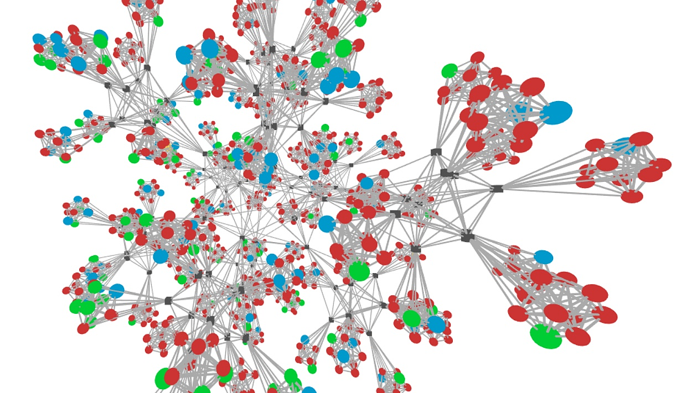

Introduction
============

This document describes MADT, a distributed application modeling system,
designed to study the impact of network conditions on the operation of such applications and
their general testing.
Main features of MADT:

* Realistic simulation of large scale IP networks
* Deployment of a distributed application in the simulated network
* Dynamic control over network conditions in individual sections of the simulated network
* Real-time visualization of the application state

    Failed testing of a distributed application in a network of 1000 nodes

MADT can greatly facilitate the development or deployment of distributed applications.
For instance, it can be used to compare the operation of several distributed applications
under specific conditions. Besides that, developers can use MADT to verify
the stability of the application under an unstable network operation or to study the possible
influence of the network structure. And finally, researchers may find MADT useful for the demonstration of
vulnerabilities of distributed applications.

