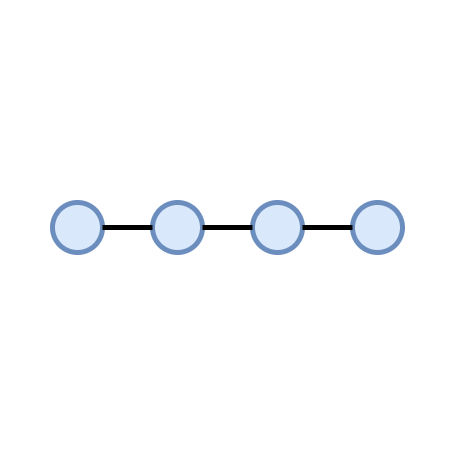
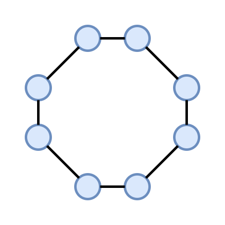
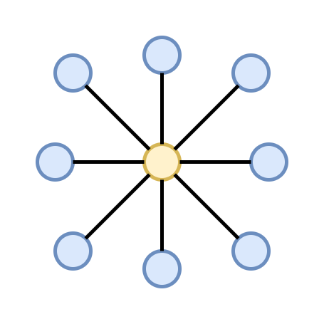
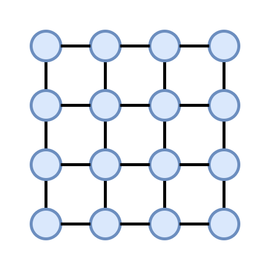
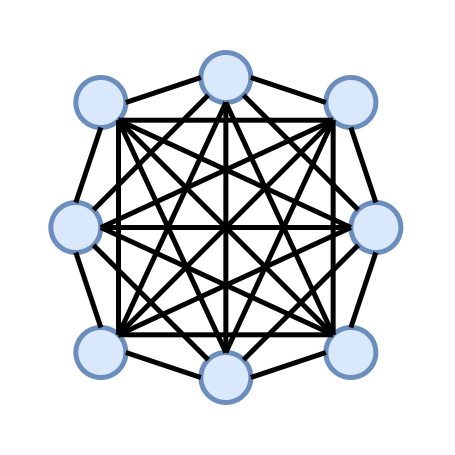
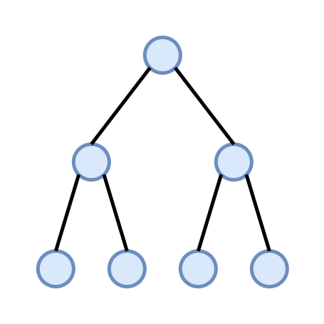
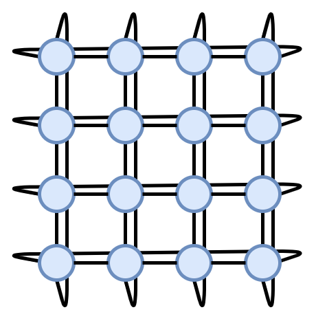
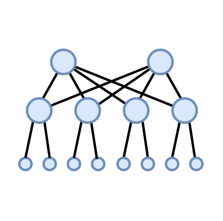

Network topologies guide
========================

Introduction
------------

Even though MADT simulates only L3 networking and does not go into troubles of L2 simulation,
it can be useful for users to test how different network structures will affect distributed application.
In this guide we will describe how to create different quasi-network topologies, starting from basics,
like bus or mesh then moving on to more complex structures, like fat trees and dragonflies.

Basic topologies
----------------

Daisy chain
^^^^^^^^^^^

In the Daisy chain topology, network nodes are connected in series,
so that each node except for two at the ends is connected to two other
nodes and any two nodes are connected through the others.

In order for nodes in the chain to be able to exchange messages with each other freely,
all of them must participate in the dynamic routing overlay, except for two nodes
at the ends. However, since any two nodes are connected through the others, distributed
application that capable to relay message should be able to work in this conditions.

To create a chain topology, you can use TODO

Ring
^^^^

Ring topology based on the same principle as a daisy chain, but this time any node connected to the other two.
Using this topology you can check, how the relaying in the distributed app will adapt to the sudden network malfunction
of one of the nodes. Any two nodes are still connected through others, so relaying will be still possible, but the application providing it will have to adapt.

To create a ring topology, you can use TODO

Star
^^^^

The star topology connects a group of nodes through a single device. For the ethernet network it's probably going to be
a hub or switch, for IP networks - routers. When testing a distributed application it makes sense
to use a simle node as a central device of the star.

There is no separate method to build a start topology, but you can use for loop and TODO: ::
	
    TODO

Grid
^^^^

Grid topology is a generalization of the chain, where each nodes connected to more than two nodes. It can be used both
in testing and benchmarking of distributed applications.

To create a ring topology, you can use TODO

Mesh
^^^^

In the mesh networks any node directly connected to all of the others. Even though this topology seems useless
when it comes to studying the impact of the networking on the application, it can be used as a baseline or for
perfomance testing. Besides that, mesh networks are ufted used when building more complex topology.

To create a ring topology, you can use TODO

Tree
^^^^

Tree networks arranges nodes in a hierarchical structure with several child nodes attached to the parent nodes.
These networks can have several layers with number of child nodes varying from node to node. This is natural topology
for the IP networks in the Internet.
You can use TODO to create a tree network and depoy a dynamic routing overlay on top of it if needed.

Complex topologies
------------------

2-D Torus
^^^^^^^^^

Torus network are similar to a ring network in the same way as a grid network is similar to a chain network.
Nodes on the edge of the grid are now connected with each other, so that all nodes in the network now
has the same amount of connections. This network topology can be used to interconnect a cluster of computing nodes
in the cluster.

To create a torus network, you can use TODO

Fat-tree
^^^^^^^^

The fat-tree is a common topology to use in the supercomuting. It's allows you to interconnect a large amount
of end-devices with a switches that have limited number of ports. The most destinctive property of the fat-trees
is that for each intermediate device same number of links goes to its childs and parents
(and a device can have more than one parent). This allows any pair of node in the network to communicate
at full bandwidth simultaneously, unlike in the usual trees.

To create a fat tree topology, you can use TODO
