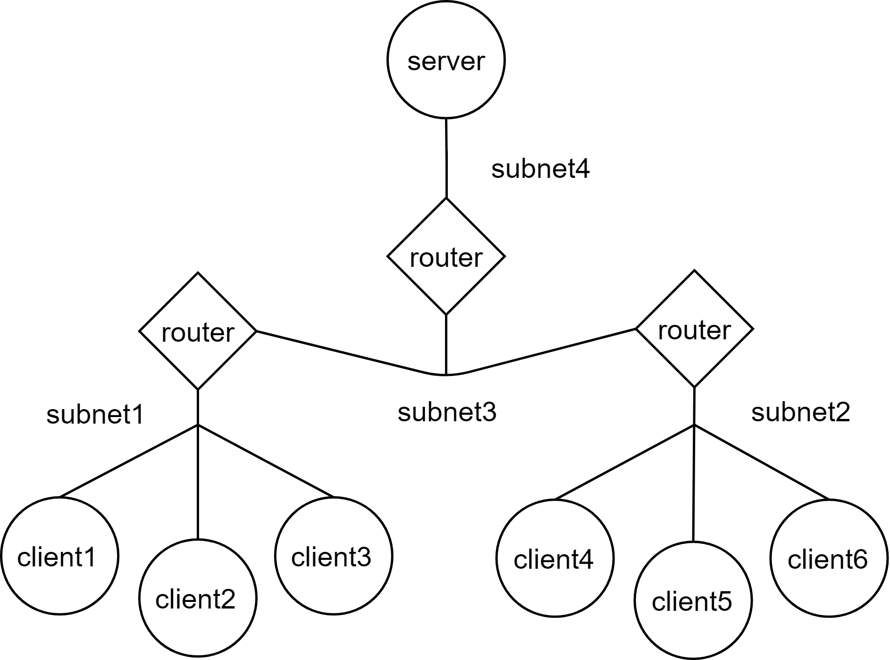
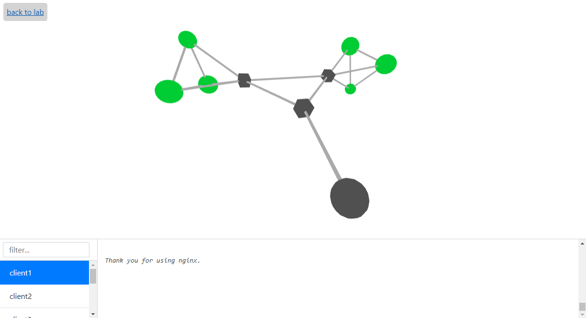

Quickstart
==========

Basic tutorial
--------------

Let's start with the simplest possible example: a single web server and a single client
connected to the same subnet. We will use Nginx as a server and a simple shell script
as a client.
To define a MADT model representing this scenario, we will use madt_lib python API:

.. literalinclude:: ../tutorials/basic/lab.py

As you can see, we're using images when creating nodes. These are docker images,
and the only requirement for docker image to be used with madt is the availability of
commands ip, route and iptables. All of them are available in most Linux distributives.
However, these commands may be missing in some docker images, like the official Nginx image.
Because of that, we'll have to build our image based on the official one.
That's what Dockerfile for our new image looks like:

.. literalinclude:: ../tutorials/basic/Dockerfile
    :language: dockerfile

Besides our custom image, we'll use inutano/wget, a simple image of alpine Linux with wget pre-installed.
All you need to do now is to create a model folder using the python script described earlier: ::

    python3 lab.py

Build a custom Nginx image: ::

    docker build -t madt/nginx .

After that our model is ready for launch. The main page of the MADT web UI should already have it listed
as "basic_tutorial". To launch the model, click the restart button on the model's page.

You can use the docker ps command to verify that containers running. To stream logs of the client you can
use another docker command: ::

    dockers logs -f MADT_basic_tutorial_client

With the running model you can go to the MADT_tutorial_client container page in the MADT web UI.
It allows you to control the state of node network connections. For instance, setting
loss percentage to 100% will make it impossible for client to reach server. You can
try it yourself and see the result in client’s logs.

Dynamic routing tutorial
------------------------

Now let’s try to implement a little more complicated network. We'll use the same client and server images,
but this time we will increase the number of clients. More than that, clients will be connected to different
subnetworks. To allow clients from every subnetwork reach server, we will configure RIP dynamic routing
protocol in the network. Since we already have all the docker images ready, all we need to do is to create
a new python script to generate the model.

Same as before, this script will start with mad_lib imports and instantiation of the Network class:

.. literalinclude:: ../tutorials/dynamic_routing/lab.py
    :lines: 1-2

Now let's introduce a server and several clients to the network:

.. literalinclude:: ../tutorials/dynamic_routing/lab.py
    :lines: 4-6

Latter method of the network will generate 9 nodes with names client1..client6.

Now we need to think over the structure of the virtual network.
For this tutorial something like this will do:

Now that we know what we want to achieve, let’s create routers
and connect everything with subnetworks:

.. literalinclude:: ../tutorials/dynamic_routing/lab.py
    :lines: 8-12

To enable RIP dynamic routing protocol for newly created routers we well use
:py:meth:`.Network.create_overlay` method of the network:

.. literalinclude:: ../tutorials/dynamic_routing/lab.py
    :lines: 14

The first argument refers to the protocol to use in the overlay. The second argument
specifies the name for the overlay and just like with the subnetworks, the last one
lists all routers that will share routing information using specified protocol.

Now all we got to do is to distribute IP addresses in the network using :py:meth:`.Network.configure`
method, pass server IP address to clients and then save the model to the directory.
After running new script, you’ll find new model in the MADT web interface. You can now
launch it and check if disconnecting the network connections of the router affects
the clients connected to it.

Monitoring tutorial
-------------------

As you probably noticed, tracking the state of several nodes with docker logs can be
inconvenient. MADT provides a monitoring system that allows you to send messages
from the model nodes and display them in real-time in the web interface.

Messages can be sent either with small helper class MADT_Client available
in the madt_client python module or with ZMQ messaging library directly.
In this tutorial, we'll use the former option.

Earlier we used wget to send requests to the server. If we want to send messages via
madt client, we'll have to implement a new client script using Python.
To do that we will use the requests library to query the server every second and then use
MADT_Client.send method to send message to the monitoring system:

.. literalinclude:: ../tutorials/monitoring/client.py

MADT_Client.send  accepts three arguments: status code (0, 1, 2 or 3), log (string) and
traffic (any number). All of them will appear in one way or another in the web interface.

We also need to implement a new Docker image for the client based on the madt/client image:

.. literalinclude:: ../tutorials/monitoring/Dockerfile
    :language: dockerfile

After building the new image we can change the model creation script described in the previous
tutorial to use it on client nodes (assuming that new image tagged as madt/pyget):

.. literalinclude:: ../tutorials/monitoring/lab.py
    :lines: 5

Now you can run the script to refresh the model files and launch it in the web interface.
Click on the "graph" button on the laboratory page will take you to the monitoring system
web-interface, where you’ll see something like this:

Cubic nodes of the graph represent routers and round ones - all the other nodes of the model.
If your models functioning properly, clients will be able to reach the server. After a successful request,
each client sends a message with status equal to 0 to the MADT. This makes the corresponding node turn green
in the web interface. Other statuses will make the node turn red(1), yellow(2) or purple(3).
Log from the message will be available in the lower panel of the monitoring interface and
the traffic will affect the node size.

You can try to set the loss percentage to 33% on one of the routers and see how it’ll affect clients.
Click directly on the graph nodes to get to the corresponding container’s page faster.

