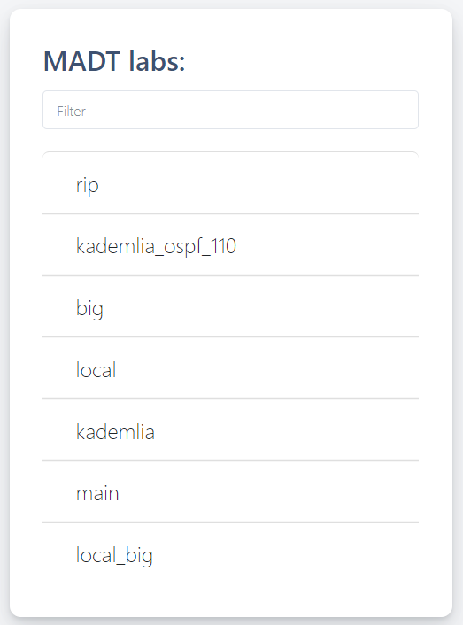
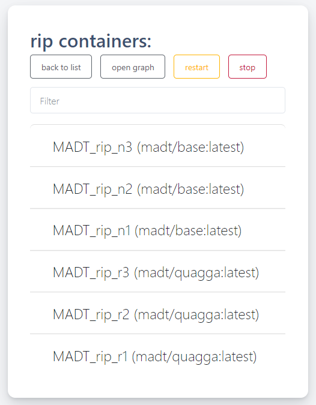
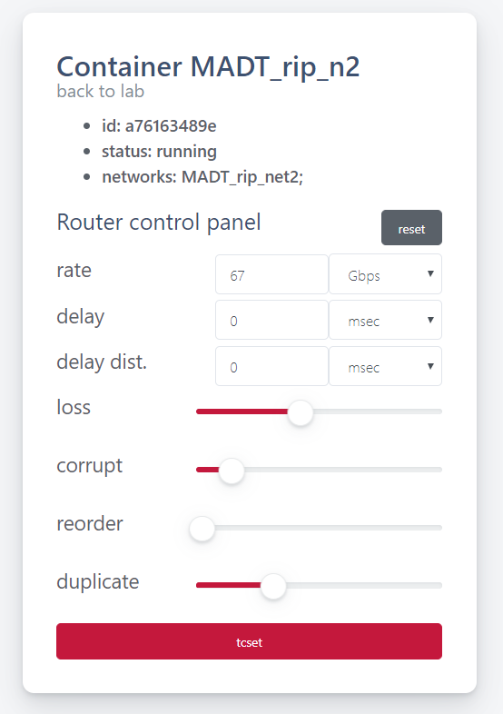
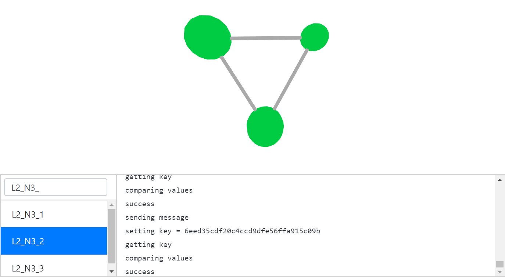

Руководство пользователя
========================

Основным объектом, вокруг которого построена вся система MADT, является лаборатория или, 
иначе, модель сети. Эти термины используются взаимозаменяемо и относятся к виртуальной IP-сети 
и распределенному приложению, работающему поверх виртуальной сети. 
Для запуска модели MADT использует минимальный объем информации о структуре виртуальной сети 
и процедуре запуска распределенного приложения. Этот набор информации также можно 
назвать моделью. MADT сохраняет эту информацию в JSON-сериализованном файле lab.json.

Модуль python :py:mod:`madt_lib` предоставляет инструменты как для 
описания моделей, так и для их запуска.
Веб-интерфейс (madt_ui), с другой стороны, предназначен только для 
запуска и остановки моделей и мониторинга запущенных моделей.
Стоит также отметить, что часть madt_lib, отвечающая за определение модели, 
не имеет зависимостей и может работать в любой среде, где доступен python3. 
Поскольку модели не зависят от среды, пользователи MADT могут создавать 
модели где угодно и затем запускать их на любой машине, на которой есть MADT.

Описание модели
---------------

Как упоминалось ранее, модуль madt_lib используется для создания моделей.
Он предоставляет четыре класса для определения сетевой модели:

1. :py:class:`madt_lib.Node` представляет сетевые узлы. Есть два типа узлов:
   роутеры и компьютеры (ПК). Маршрутизаторы обеспечивают динамическую маршрутизацию 
   пакетов в сети, а на компьютерах размещаются компоненты тестируемого приложения. 
   Помимо типа узла, этот класс позволяет вам контролировать дополнительные параметры 
   docker контейнера, который будет использоваться для моделирования узла.
2. :py:class:`madt_lib.Subnet`  представляет подсеть IP, которая соединяет набор узлов.
3. :py:class:`madt_lib.Overlay` используется для настройки динамической маршрутизации в сети. 
   Это необходимо для передачи данных между компьютерами из разных подсетей. 
   Для настройки протоколов динамической маршрутизации RIP и OSPF требуется только список 
   маршрутизаторов, участвующих в протоколе, а для BGP также необходимо указать разделение 
   сети на автономные подсистемы и назначить маршрутизатор каждой из них.
4. :py:class:`madt_lib.Network` представляет глобальную или локальную сеть. Каждый узел, 
   подсеть или оверлей сети должны создаваться только с использованием его методов. 
   Лаборатория может иметь только одну глобальную сеть, которую можно использовать для 
   создания нескольких локальных сетей. Локальные сети используются для настройки NAT. 
   В некотором смысле глобальная сеть представляет собой целую лабораторию.

Определение модели начинается с экземпляра Network, который становится глобальной сетью. 
Затем в этой сети создаются узлы и подсети, их соединяющие. 
После этого можно добавить оверлеи для динамической маршрутизации и локальные сети.
Все локальные сети должны быть заполнены в том же порядке.

Когда вся работа с сетями завершена, вызывается метод глобальной сети :py:meth:`.Network.configure`.
Он распределяет IP-адреса хостов и подсетей. 
Вновь назначенные IP-адреса могут быть использованы для обновления параметров узлов. 
Например, IP-адрес сервера может быть передан клиентским узлам в качестве переменной среды.
Распределение адресов остается неизменным до изменения структуры сети (включая оверлеи).

Другой метод глобальной сети :py:meth:`.Network.render` сохраняет лабораторию по указанному пути.
Сохраненный файл lab.json можно использовать для запуска модели 
с использованием сценария python madt.py или веб-интерфейса madt_ui.

Запуск модели
-------------

Для запуска моделей можно использовать сценарий madt.py, 
который удобен для проверки правильности определения модели, 
или веб-интерфейс madt_ui, который позволяет отслеживать работу компонентов приложения в модели.

Синтаксис для вызова madt.py: ::

    python3 madt.py [start|stop|restart] [ lab_path ] [ prefix ]

Первый аргумент определяет действие, которое нужно выполнить с моделью:
запуск, остановка или перезапуск; 
второй должен содержать путь к папке с файлом lab.json, 
который содержит определение модели; третий аргумент --- это префикс, 
который наряду с именем модели будет добавлен к именам docker контейнеров и 
сетей, которые будут созданы внутри модели.
Различные префиксы позволяют запускать несколько копий модели одновременно.

Главная страница веб-интерфейса madt_ui содержит список всех доступных моделей. 
Нажмите на название модели, вы попадете на страницу модели с панелью управления вверху 
и списком всех контейнеров, работающих в модели, внизу. 
На панели управления модели есть 4 кнопки. 
Кнопка graph откроет панель управления, которая будет описана в отдельном разделе, 
кнопка restart перезапустит работающую модель или запустит остановленную модель, 
а кнопка stop остановит модель. 
Как и на главной странице, так и на странице модели есть поля фильтра, 
которые позволяют вам найти нужную модель или контейнер по имени.

На данный момент веб-интерфейс не поддерживает одновременный запуск 
нескольких копий одной и той же модели, и префикс, 
используемый для всех контейнеров в моделях, запускаемых через него, \MADT_

Нажмите на название контейнера, и вы попадете на страницу контейнера. 
Она содержит интерфейс, который позволяет вам управлять различными ограничениями 
сетевых подключений контейнера. Используя эту страницу, вы можете установить 
пропускную способность соединений, задержку передачи сообщений и процент потери, 
повреждения, перестановки и повторения пакетов. 
После установки желаемых значений на панели, нажмите кнопку «tcset», 
чтобы установить ограничения.
Кнопка reset сбрасывает все ограничения. 
Eсли на контейнер уже наложены ограничения, панель их отобразит.

Мониторинг
----------

Система мониторинга моделей, предоставляемая MADT, основана на 
библиотеке сообщений ZMQ и использует сокеты IPC в качестве транспорта.
Моделируемое приложение (или оболочка скрипта) может подключаться к 
системе мониторинга через сокет, смонтированный как /lab/lab.sock к контейнеру. 
После этого он может использовать любую из более чем 40 библиотек ZMQ для разных 
языков программирования для отправки сообщений в систему мониторинга.

MADT получает сообщения в формате JSON и ожидает, что сообщение будет иметь 4 поля:

1. status - целочисленное значение от 0 до 3,
2. traffic - любое целочисленное значение,
3. log - строка,
4. hostname - значение переменной окружения $HOSTNAME.

Сервер веб-интерфейса MADT получает эти сообщения и позволяет 
пользователям просматривать их содержимое в графическом интерфейсе:

Значение поля состояния влияет на цвет узла (0 - зеленый, 1 - красный, 2 - желтый, 3 - фиолетовый), 
трафик определяет его размер, а логи отображаются на специальной панели. 
Поле имени хоста используется для идентификации отправителя.
Если навести курсор на узел, вы увидите его имя, а при нажатии на него 
откроется страница контейнера с панелью управления качеством сетевых подключений, описанной ранее.

Подготовка приложения к тестированию
------------------------------------

Чтобы протестировать ваше приложение с MADT, вам нужно подготовить образ docker 
для каждого из его компонентов.
Если вам нужно передать какие-либо данные узлам, вы можете использовать либо переменные среды, 
либо изменить команду запуска контейнера с помощью окружения или 
параметров команды из API-интерфейса Docker на Python при создании узлов.
Имея образы, вы можете запустить лабораторию MADT со своим приложением.

Однако, чтобы иметь возможность отслеживать состояние большого количества узлов в модели, 
необходимо включить мониторинг MADT для вашего приложения. 
Самый простой способ сделать это --- использовать модуль python madt_client helper. 
Если вам это не подходит, вы можете использовать любую из 40+ библиотек ZMQ для разных 
языков программирования, чтобы подключаться к сокету IPC и отправлять сообщения вручную. 
В обоих случаях вам необходимо написать скрипт-обертку или псевдоклиент, 
который будет тестировать различные функции вашего приложения и отправлять результаты в MADT.
