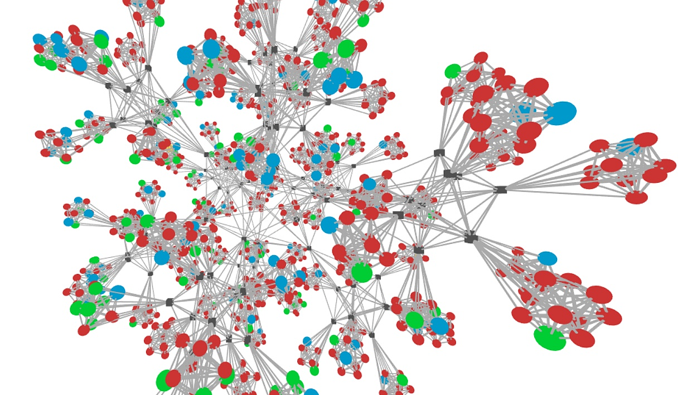

Введение
========

Здесь описан проект MADT, система для моделирования распределенных приложений,
разработанная для изучения влияния условий сети на работу таких приложений 
и их тестирования.

Главные особенности MADT:

* Реалистичное моделирование крупномасштабных IP-сетей,
* Развертывание распределенной системы в моделируемой сети,
* Динамический контроль состояния отдельных участков моделируемой сети,
* Визуализация состояния распределенного приложения в реальном времени.

    Сбой тестирования распределенного приложения для сети из 1000 узлов

MADT может значительно облегчить разработку и развертывание распределенных приложений.
Например, его можно использовать для сравнения работы нескольких 
распределенных приложений в заданных условиях. 
Кроме того, разработчики могут использовать MADT для проверки стабильности приложения 
в условиях нестабильной работы сети или для изучения возможного влияния структуры сети. 
Исследователи могут найти MADT полезным для демонстрации уязвимостей распределенных приложений.
