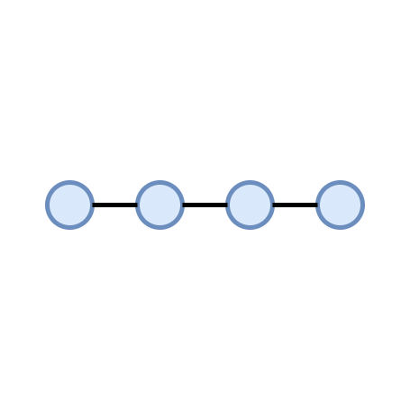
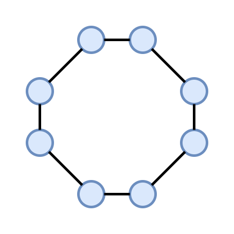
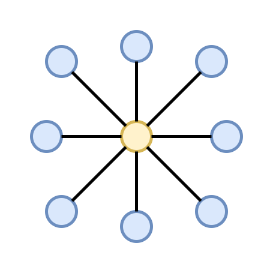
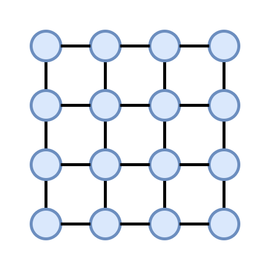
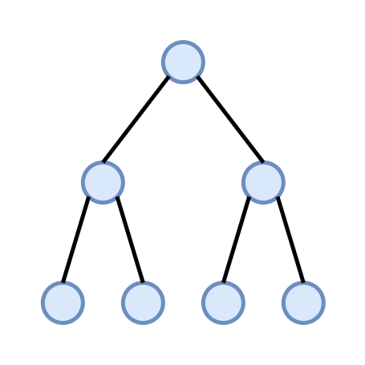
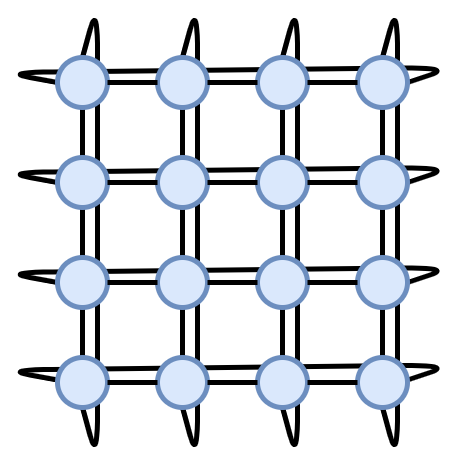
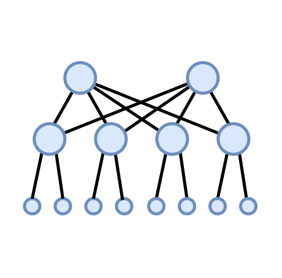

Сетевые топологии
=================

Введение
--------

Даже несмотря на то, что MADT моделирует только сетевое взаимодействие L3 и не сталкивается 
с проблемами моделирования L2, пользователям может быть полезно проверить, 
как различные структуры сети будут влиять на распределенное приложение.
В этом руководстве мы опишем, как создавать различные квази-сетевые топологии, 
начиная с основ, таких как шина или решетка, переходя к более сложным структурам, 
таким как fat tree и dragonfly.

Базовые топологии
-----------------

Шина
^^^^

В топологии Шина сетевые узлы соединены последовательно,
так что каждый узел, кроме двух на концах, соединен с двумя другими 
узлами и любые два узла связаны через другие.

Чтобы узлы в цепочке могли свободно обмениваться сообщениями друг с другом,
все они должны участвовать в оверлее динамической маршрутизации, за исключением двух узлов
на концах. Однако, поскольку любые два узла связаны через другие, распределенное
приложение, способное передавать сообщения, может работать в таких условиях.

Для создания топологии шины вы можете использовать TODO

Кольцо
^^^^^^

Кольцевая топология основана на том же принципе, что и шина, 
но на этот раз любой узел без исключения соединен с двумя другими.
Используя эту топологию, вы можете проверить, 
как передача сообщений в распределенном приложении будет адаптироваться к 
внезапной неисправности сети одного из узлов. Любые два узла по-прежнему 
связаны через другие, поэтому передача все еще будет возможна, 
но приложению, обеспечивающему его, придется адаптироваться.

Для создания топологии кольцо вы можете использовать TODO

Звезда
^^^^^^

Топология звезда соединяет группу узлов через одно устройство. 
Для сети Ethernet это, например, будет концентратор или коммутатор, 
для сетей IP --- маршрутизаторы. При тестировании распределенного приложения имеет смысл 
использовать обычный узел в качестве центрального устройства звезды.

Не существует отдельного метода для построения топологии звезда, 
но вы можете использовать для цикла и TODO
    TODO

Решетка
^^^^^^^

Топология решетка --- это обобщение шины, где каждый узел связан с более чем двумя узлами. 
Его можно использовать как для бенчмаркинга, так и для тестирования распределенных приложений.

Для создания этой топологии вы можете использовать TODO

Ячейка
^^^^^^
.. image:: _static/topologies/mesh.png
    :scale: 25 %
    :align: right

В ячеистых сетях любой узел напрямую связан со всеми остальными. 
Несмотря на то, что эта топология кажется бесполезной, когда дело доходит до изучения 
влияния сети на приложение, ее можно использовать в качестве базы
или для тестирования производительности. 
Кроме того, ячеистые сети часто используются при построении более сложной топологии.

Для создания этой топологии вы можете использовать TODO

Дерево
^^^^^^

Древовидные сети упорядочивают узлы в иерархической структуре с несколькими дочерними узлами, 
связанными родительскими узлами.
Эти сети могут иметь несколько уровней с числом дочерних узлов, варьирующихся от узла к узлу. 
Это естественная топология для IP-сетей в Интернете.
Вы можете использовать TODO для создания древовидной сети и при 
необходимости накладывать поверх нее оверлей динамической маршрутизации.

Сложные топологии
-----------------

Тор
^^^

Сеть тор аналогична кольцевой сети так же, как решетка похожа на шину.
Узлы на краю сетки теперь связаны друг с другом, так что все узлы в сети теперь 
имеют одинаковое количество соединений. 
Эта топология сети может использоваться для соединения кластера вычислительных узлов в кластере.

Чтобы создать сеть тор, вы можете использовать TODO

Fat-tree
^^^^^^^^

Fat-tree --- это топология, обычно используемая в суперкомпьютерах. 
Она позволяет соединить большое количество
конечных устройств с коммутаторами, которые имеют ограниченное количество портов. 
Самое характерное свойство этой топологии --- для каждого промежуточного устройства 
одинаковое количество ссылок идет на дочерние и родительские узлы, 
и устройство может иметь более одного родителя. 
Это позволяет любой паре узлов в сети общаться
на полной пропускной способности одновременно, в отличие от обычных деревьев.

Чтобы создать эту топологию, вы можете использовать TODO 
