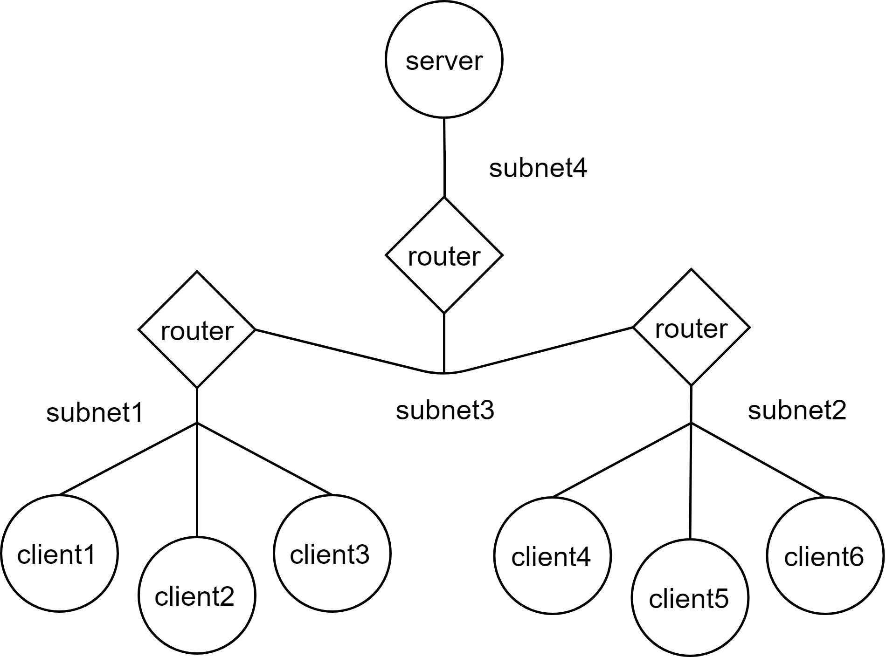
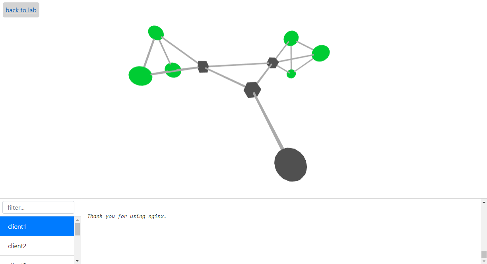

Начало работы
=============

Приведенные ниже примеры доступны в `репозитории проекта <https://github.com/dltcspbu/madt/tree/docs/tutorials/>`_.

Основы
------
Начнем с самого простого возможного `примера <https://github.com/dltcspbu/madt/tree/docs/tutorials/basic>`_: 
один веб-сервер и один клиент подключены к единой подсети. 
Мы будем использовать Nginx в качестве сервера и простой shell-скрипт в качестве клиента.
Чтобы определить модель MADT, представляющую этот сценарий, 
будем использовать API для madt_lib на python:

.. literalinclude:: ../tutorials/basic/lab.py

Как видите, мы используем docker-образы при создании узлов. 
Единственное требование к образу, которое должно выполняться для работы с madt, ---
это наличие команд ip, route и iptables. 
Все они доступны в большинстве дистрибутивов Linux.
Однако эти команды могут отсутствовать в некоторых образах, например, в официальном образе Nginx.
Из-за этого нам придется строить собственный docker-образ на основе официального.
Вот как выглядит Dockerfile для нашего нового образа:

.. literalinclude:: ../tutorials/basic/Dockerfile
    :language: dockerfile

 
Помимо нашего пользовательского образа, 
мы будем использовать inutano/wget, простой образ Alpine Linux с предустановленным wget.
Все, что вам нужно сделать, 
это создать папку для модели, используя скрипт Python, описанный ранее: ::

    python3 lab.py

Построение пользовательского образа Nginx: ::

    docker build -t madt/nginx .

После этого наша модель готова к запуску. На главной странице веб-интерфейса MADT 
она указана как «basic_tutorial». Чтобы запустить модель, 
нажмите кнопку перезагрузки на странице модели.

Вы можете использовать команду docker ps, чтобы убедиться, что контейнеры работают. 
Для потоковой передачи логов клиента вы можете использовать другую команду docker: ::

    dockers logs -f MADT_basic_tutorial_client

После запуска модели вы можете перейти на страницу контейнера 
MADT_tutorial_client в веб-интерфейсе MADT.
Здесь вы можете контролировать состояние сетевых соединений узла. 
Например, установка процента потерь в 100% сделает невозможным доступ клиента к серверу. 
Вы можете посмотреть результат в логах клиента.

Пример динамической маршрутизации
---------------------------------

Далее представлена реализация более сложной сети. 
Мы будем использовать те же образы клиента и сервера, но на этот раз мы увеличим 
количество клиентов. Более того, клиенты будут подключены к различным подсетям. 
Чтобы позволить клиентам из каждой подсети обращаться к серверу, мы настроим протокол 
динамической маршрутизации RIP в сети. Поскольку у нас уже есть все готовые образы, все, 
что нам нужно сделать, --- это создать новый скрипт Python для генерации модели.

Как и ранее, этот скрипт будет начинаться с импорта mad_lib и создания экземпляра класса Network:

.. literalinclude:: ../tutorials/dynamic_routing/lab.py
    :lines: 1-2

Далее опишем сервер и несколько клиентов в сети:

.. literalinclude:: ../tutorials/dynamic_routing/lab.py
    :lines: 4-6

Последний метод генерирует 6 узлов: client1..client6.

Теперь нам нужно продумать структуру виртуальной сети.
Для этого примера подойдет:

Теперь, когда мы знаем, чего хотим достичь, создадим маршрутизаторы 
и соединим все с подсетями:

.. literalinclude:: ../tutorials/dynamic_routing/lab.py
    :lines: 8-12

Чтобы включить протокол динамической маршрутизации RIP для вновь созданных маршрутизаторов, 
мы используем метод
:py:meth:`.Network.create_overlay`:

.. literalinclude:: ../tutorials/dynamic_routing/lab.py
    :lines: 14

Первый аргумент относится к протоколу для использования в оверлее. 
Второй аргумент задает имя для оверлея и, как и в подсетях, последний 
перечисляет все маршрутизаторы, которые будут обмениваться информацией о 
маршрутизации, используя указанный протокол.

Теперь все, что нам необходимо сделать, --- это распределить IP-адреса в сети, 
используя метод :py:meth: `.Network.configure`, передать клиенту IP-адрес сервера 
и затем сохранить модель в каталоге.
После запуска нового скрипта вы найдете новую модель в веб-интерфейсе MADT. 
Теперь вы можете запустить его и проверить, влияет ли отключение сетевых 
подключений маршрутизатора на клиентов, подключенных к нему.

Пример мониторинга
------------------

Как вы могли заметить, отслеживание состояния нескольких узлов с помощью логом docker 
может быть неудобным. MADT предоставляет систему мониторинга, которая позволяет 
отправлять сообщения с узлов модели и отображать их в режиме реального времени в веб-интерфейсе.

Сообщения можно отправлять либо с помощью небольшого вспомогательного класса MADT_Client, 
доступного в модуле python madt_client, либо напрямую из библиотеки сообщений ZMQ.
В этом примере мы будем использовать первый вариант.

Ранее мы использовали wget для отправки запросов на сервер. 
Если мы хотим отправлять сообщения через клиент Madt, нам нужно реализовать новый 
клиентский скрипт с использованием Python.
Для этого мы будем использовать библиотеку запросов для осуществления запросов 
к серверу каждую секунду, 
а затем используем метод MADT_Client.send для отправки сообщения в систему мониторинга:

.. literalinclude:: ../tutorials/monitoring/client.py

MADT_Client.send принимает три аргумента: status code (0, 1, 2 или 3), 
log (строка) и traffic (любое число). Все они так или иначе представлены в веб-интерфейсе.

Необходимо реализовать новый образ docker для клиента на основе образа madt/client:

.. literalinclude:: ../tutorials/monitoring/Dockerfile
    :language: dockerfile

После создания нового образа мы можем изменить сценарий создания модели, 
описанный в предыдущем руководстве, чтобы использовать его на клиентских узлах 
(при условии, что новый образ помечен как madt/pyget):

.. literalinclude:: ../tutorials/monitoring/lab.py
    :lines: 5

Теперь вы можете запустить скрипт, чтобы обновить файлы модели и запустить его в веб-интерфейсе.
Нажмите кнопку «graph» на странице лаборатории, чтобы перейти к веб-интерфейсу 
системы мониторинга, где вы увидите следующее:

Кубические узлы графа представляют собой маршрутизаторы, а круглые --- все остальные узлы модели.
Если ваши модели работают нормально, клиенты смогут связаться с сервером. 
После успешного запроса каждый клиент отправляет сообщение со статусом, равным 0, в MADT. 
Это делает соответствующий узел зеленым в веб-интерфейсе. 
Другие состояния представлены красным (1), желтым (2) или фиолетовым (3) цветом.
Логи из сообщения будут доступны в нижней панели интерфейса мониторинга, 
и трафик будет влиять на размер узла.

